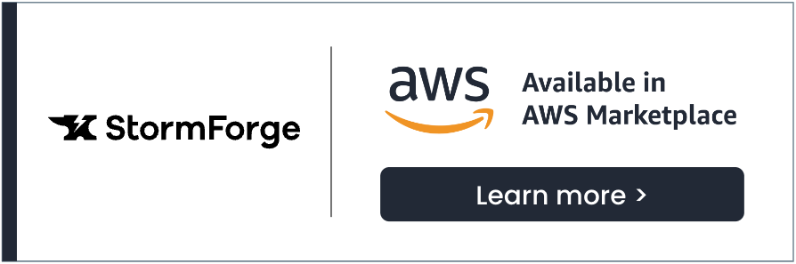

# Right Size Workload Resources on EKS with StormForge

## Welcome

Welcome to the StormForge Optimize Live hands-on workshop. In this workshop, you will learn how StormForge Optimize Live can be used to continuously rightsize Kubernetes workloads. With this knowledge, you can ensure that your cloud-native applications are both cost effective and performant while removing developer toil.

### Who should take this workshop?
* Platform Engineers
* DevOps Engineers
* Site Reliability Engineers (SRE's)
* Cloud Solution Architects
* Kubernetes Application Developers
 

{}
The examples and sample code provided in this workshop are intended to be consumed as instructional content. These will help you understand how various services can be architected to build a solution while demonstrating best practices along the way. These examples are not intended for use in production environments.
{}

